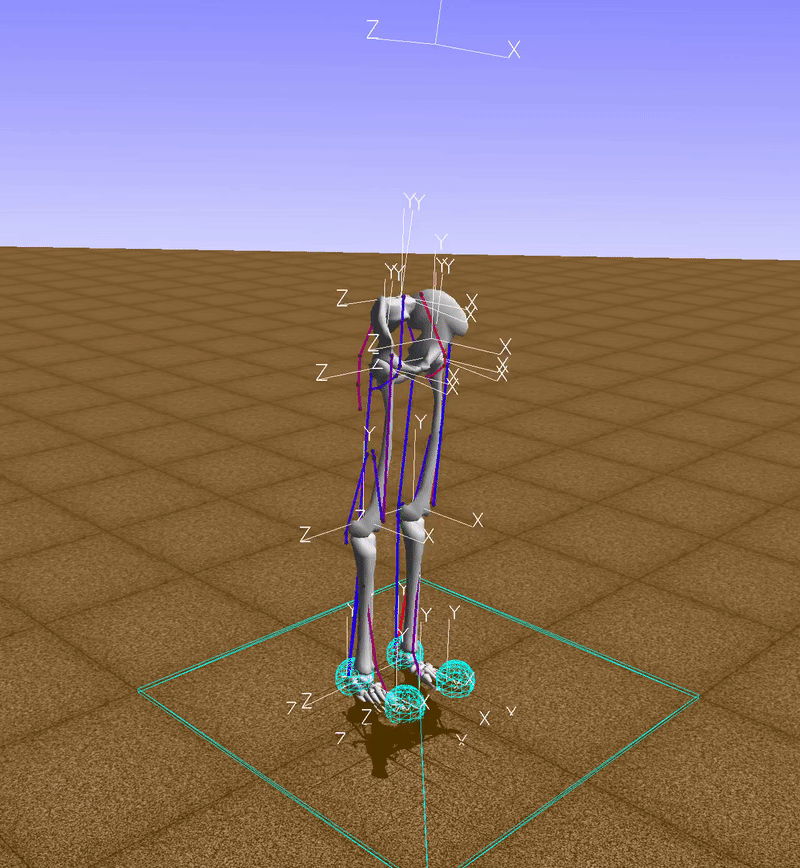
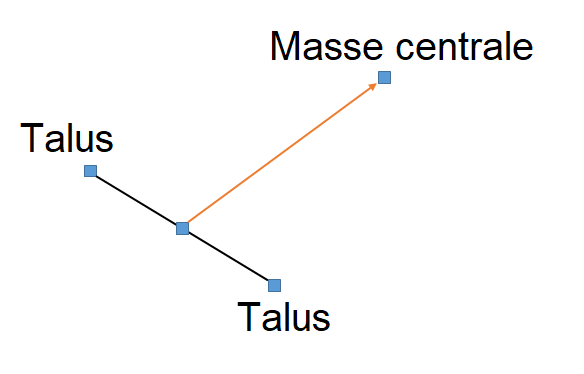
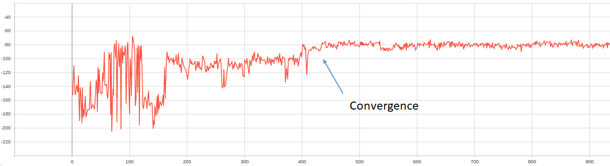
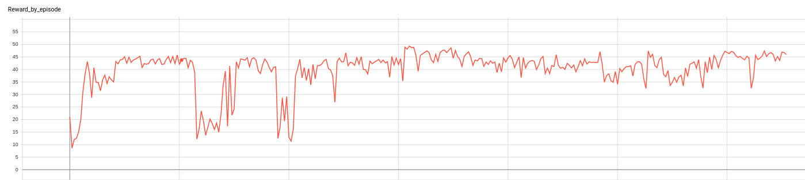
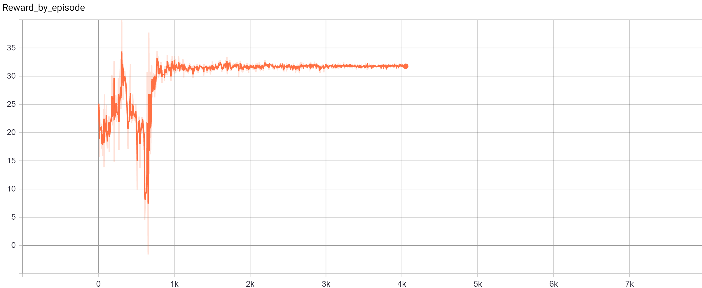
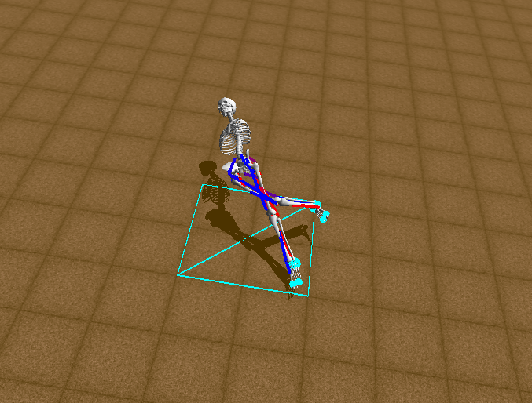

# NeurIPS 2019 Challenge : Learn to Move - Walk Around 
In this project, we used the musculoskeletal reinforcement learning environment made by Standford University (http://osim-rl.stanford.edu/).
Our purpose was to create a model using Reinforcement Learning which can fall in the direction we want (left, right, front, behind).

## 1. Algorithm
We used DDPG Actor-Critic for this project. All the components were implemented by Python 3.6.1, Tensorflow 1.14 and executed on Google Engine.
For exploration of the model, we added OU-Noise directly to each action during training. 
Noise added in each iteration was decayed so that at the last iterations, model would act by his knowledge.
Because the action space and observation space were very large, it was very difficult for the model to choose a good action
each iteration. Therefore, we used Prioritized Experience Replay (https://arxiv.org/pdf/1511.05952.pdf) to assure the convergence. 
In fact, PER worked much better than Uniform Experience Replay.
 
We didn't vary the architecture of neural networks in Actor and Critic in this project but tried many approaches for reward function
and learning strategy. 

## 2. Reward fonction
### 2.1 Define the direction of body
The direction of body was not defined by default in the environment so that we had to find to define this very important component.
 

This image shows all the positions in the low party of body. For the direction of body, we took the midpoint of right talus and 
left talus, then calculated the vector from this point to center mass of the body. This approach was not always exact, especially
when the leg was raised but it was acceptable. 

### 2.2 Define the direction we want to fall
The image also shows the direction of the body in 3 axis ; X, Y, Z. At the begining of each episode, the body was symetric by
the axis Oy. Therefore, the left of body was the negative direction of axis Oz and the right was vector Oz. By this definition,
we can easily difnie the direction that we want the body to fall.

### 2.3 Reward fuctions
We have tried 3 different approaches based on 2 definitions above for reward function. 
#### Penalization between the direction of body and direction chosen to fall
Our purpose was to make the body fall in the direction we had chosen. It means that the angle between the body and the 
chosen direction has to be as small as possible. Therefore, we put a penalization (negative reward) on the angle between 
the direction of body and the chosen direction so that during training, the model would learn how to fall in the direction 
we want.

We had a result after the training.

The model was converged very quickly, just after about 450 episodes. We observed the log during training and we found that 
model stuck in local optimum. It did find the way to minimize the penalization it received by falling as soon as possible 
in a random direction. It didn't care about the direction that we had chosen. We tried to add many noise to get a better 
exploration but the result was still the same. 

#### Reward function based on cosine of angle between the body and the direction we want to fall
One interresting property of cosine function is that closer 2 vecters, bigger the returned value by the function.
As we mentionned before, we want to minimize the angle between the body and the direction we want to fall. Consequently, 
we used cos function as our reward function.

We added many noise to this model and the noise decaying was slow. After the fine-tuning, we had a model that can fall 
about 45° which. 

#### Reward function by the difference of the angle between the body and the direction we want to fall in previous episode
and the actual angle between the body and the direction we want to fall

We always wanted to minimize the angle between the body and the direction we want to fall. Hence, we encouraged the model to  
to move to the direction we want it to fall each time step. If it can tend to the direction we want it to fall after each 
time step, we give it a reward, or else a penalization. 

We got an interesting result : the model could fall about 47° in the direction we had chosen. We visualized the model and we 
found that its behaviors were very similar to the one trained by second reward function. 

## 3. Result
After the fine tuning, we have got 2 models which can fall in the direction we had chosen. In this case, we fixed the right
as the direction we want the model to fall. The model falling to the right has the same behaviors because our environment
is symetric. 

As we see in the image, to be able to fall to the right, the model tried to raise his right leg which led to a imbalance 
state so that the body can fall to the right. It was reasonable because the observation space has only the components of 
low party of the body. We observed the log during training and we found that the model couldn't fall with an angle more
than 55°, and in training it rarely fell with an angle more than 47°. This was the best result we could have with these approaches. 

We can explain this problem due to the lack of inforamtion about the relationship between the components of the body and 
the direction of the body. If we have more information, we can modelize a new reward function more directly to the observation
space of the environment.

## Instruction
* ./src : All the important sources for DDPG and PER
* ./Actor_Critic : sources of Actor-Critic algorithm
    * train.sh : modify the hyper-parameters for training. run bash train.sh
    * visualization.sh : visualization
* ./checkpoints : important checkpoints
